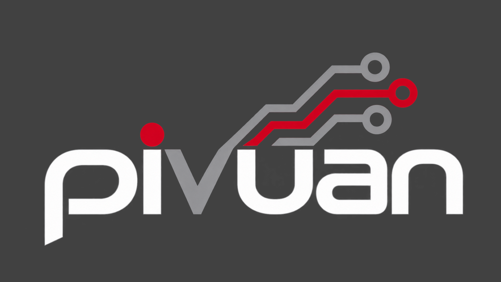

<p align="center">
  <picture>
    <source media="(prefers-color-scheme: dark)" srcset="pivuan-logo.png">
    
  </picture>
</p>

<p align="center"><b>Devuan with sysvinit for the Raspberry Pi. No systemd.</b></p>

---

Pivuan is a minimal [Devuan](https://www.devuan.org/) 6 "excalibur" image for the Raspberry Pi,
built with the [Armbian](https://www.armbian.com/) build framework. It boots with **sysvinit**
instead of systemd, feels like an Armbian minimal image (fast boot, first-boot setup wizard,
configuration tool), and gets its updates from Devuan and from its own apt repository.

- **Minimal**: a small console system (about 850 MB used) with networking, SSH and the
  `pivuan-config` tool. Add only what you need.
- **sysvinit, no systemd**: `init` is PID 1, with elogind, eudev and ifupdown. Packages that
  would pull in systemd are left out.
- **Desktop in one command**: XFCE with a LightDM login screen, installed from the Devuan
  archive by `pivuan-config`.
- **Kept up to date**: Devuan's security updates through apt, and the Raspberry Pi kernel,
  firmware, board support and `pivuan-config` through the Pivuan apt repository.

Pivuan is built for the **Raspberry Pi 5** and uses the Raspberry Pi Foundation's kernel. The
same image is built for the other 64-bit boards it supports (Raspberry Pi 3 and 4), which are
less tested.

## Download

Get the latest image from **[Releases](https://github.com/rations/pivuan/releases)**: the
`Pivuan_<version>_Rpi4b_excalibur_current_<kernel>_minimal.img.xz` file and its `.sha` file.

Check the download (optional):

```sh
sha256sum -c Pivuan_*.img.xz.sha
```

## Install

Write the image to a microSD card (8 GB or larger). Any of these works:

- **balenaEtcher**: pick the `.img.xz` file and the card, then Flash.
- **Raspberry Pi Imager**: *Choose OS* → *Use custom* → the `.img.xz` file. Don't use its
  "OS customisation" settings; Pivuan's first-boot wizard does that.
- **Linux command line** (replace `/dev/sdX` with your card; check with `lsblk`, this erases it):

  ```sh
  xzcat Pivuan_*.img.xz | sudo dd of=/dev/sdX bs=4M conv=fsync status=progress
  ```

The image is `xz`-compressed, not a tar archive: use `xzcat`, `unxz` or `xz -d`, not `tar`.

## First boot

1. Put the card in the Pi, connect a screen and keyboard (or Ethernet), and power on.
2. The filesystem grows to fill the card and the **Pivuan setup wizard** starts on the screen.
   It asks for:
   - a new **root password**,
   - your **user name and password** (this user can use `sudo`, and always with a password;
     there is no automatic login),
   - Wi-Fi, if no network cable is plugged in.

   It also sets your time zone and language.
3. You end up at a shell with a welcome screen showing the system's state and tips.

Without a screen, connect Ethernet, find the Pi's address on your router and log in with
`ssh root@<address>` using the password **`1234`**; the same wizard then starts and makes you
change it.

## Desktop

The image is minimal on purpose. To add the XFCE desktop, log in and run:

```sh
sudo pivuan-config --cmd XFCE01
```

This installs, from the Devuan archive:

- **XFCE** with `xfce4-terminal`, the Pivuan menu icon and background,
- the **LightDM** login screen (no automatic login),
- **NetworkManager** with its tray applet (your wired and Wi-Fi settings are moved over),
- **PulseAudio** for sound and Bluetooth audio,
- **Brave Origin** as the web browser, from [Brave's apt repository](https://brave.com/linux/).

When it finishes, the login screen appears. Log in with the user you created in the wizard.

## pivuan-config

`pivuan-config` is the configuration tool: Armbian's `armbian-config` adapted for sysvinit.
Run it with a menu, or give it a command:

```sh
sudo pivuan-config                 # menu: system, network, localisation, software, desktops
sudo pivuan-config --cmd help      # list the commands
pivuan-config --help
```

## Updates

```sh
sudo apt update && sudo apt full-upgrade
```

- Everything from Devuan (the base system, the desktop, security fixes) comes from
  `deb.devuan.org`.
- The kernel, device trees, board support and `pivuan-config` come from the **Pivuan apt
  repository**, `https://rations.github.io/pivuan`, which Pivuan images already use. It is
  signed with the key `34EA 4F11 5D83 793B 6C80  3155 4769 929F 204B 18CD`.

The kernel follows the Foundation's `rpi-6.18.y` long-term branch. Each week the build checks
for a new kernel point release (they carry the security fixes); when there is one, a new
image is released here and the kernel packages reach installed systems through `apt`.

## How Pivuan is made

Pivuan is a fork of the Armbian build framework that builds Devuan with sysvinit:

| Repository | What it is |
|---|---|
| [rations/build](https://github.com/rations/build) (branch `pivuan`) | Armbian build framework fork: Devuan excalibur support, sysvinit init scripts for Armbian's first-boot and board services, the image and apt-repository workflows |
| [rations/configng](https://github.com/rations/configng) | `armbian-config` (configng) fork, packaged as `pivuan-config`: a sysvinit service backend and the Devuan desktop install |
| [raspberrypi/linux](https://github.com/raspberrypi/linux) | The Raspberry Pi Foundation's kernel, pinned to a tested `rpi-6.18.y` commit |
| [rations/pivuan](https://github.com/rations/pivuan) (this repository) | Project page, releases (images) and the apt repository (`gh-pages` branch) |

Images are built by GitHub Actions in `rations/build`, from Devuan packages checked against
Devuan's signing keys.

## Thanks

Pivuan exists because of the work of two projects:

- **[Armbian](https://www.armbian.com/)**: the build framework, board support, first-boot
  wizard, `armbian-config` and the kernel packaging are theirs. Pivuan is their work, adapted
  to boot without systemd. Please support them: <https://www.armbian.com/donate/>
- **[Devuan](https://www.devuan.org/)**: the whole operating system, init freedom, and years
  of keeping Debian usable without systemd. Please support them: <https://www.devuan.org/os/donate>

Also thanks to the [Raspberry Pi Foundation](https://www.raspberrypi.com/) for the kernel and
firmware, and to [Debian](https://www.debian.org/), which Devuan is based on.

Pivuan is an independent personal project. It is not affiliated with or endorsed by Armbian,
Devuan, Debian or Raspberry Pi Ltd.

## License

The contents of this repository are licensed under the
[GNU General Public License, version 2](LICENSE), the license of the Armbian build framework
Pivuan is built with, **except the Pivuan artwork**.

**Pivuan artwork.** The Pivuan logo and background (`pivuan-logo.png`,
`pivuan-background.png`, and the copies of them in Pivuan images and in
[rations/configng](https://github.com/rations/configng)) are © 2026 rations, all rights
reserved. They are not covered by the GPL or any other license in these repositories, and may
only be used with permission. Please ask by
[opening an issue](https://github.com/rations/pivuan/issues).

The images contain software under many licenses (the Linux kernel is GPL-2.0; Devuan and
Debian packages keep their own licenses, listed in `/usr/share/doc/*/copyright` on the
system). Source code: the build framework in [rations/build](https://github.com/rations/build)
(GPL-2.0), `pivuan-config` in [rations/configng](https://github.com/rations/configng)
(GPL-3.0), the kernel in [raspberrypi/linux](https://github.com/raspberrypi/linux), and every
Devuan package from Devuan's source archive (`apt source <package>`).
